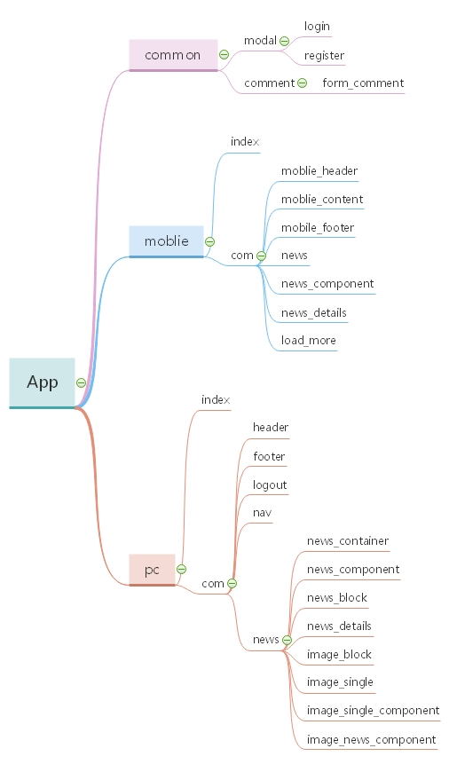

# React Demo

## 1、项目搭建

- 安装脚手架

```
npm install -g create-react-app
```

- 创建项目

```
create-react-app projectName
```

- 运行项目

```
npm start
```


## 2、项目开发准备

### 1、安装依赖

> 路由依赖，4.x以后使用react-router-dom中的对象方法

```
npm install react-router
npm install react-router-dom
```

> UI框架，使用阿里的ant design框架

```
npm install antd
```

> 响应式工具库，用于判断移动设备

```
npm install react-responsive
```

> 使用sass预处理样式

```
//暴露配置文件
npm run eject
//只需安装node-sass，配置文件中自带sass-loader
npm install node-sass
//如果下载失败，更换下载源重试
npm i node-sass --sass_binary_site=https://npm.taobao.org/mirrors/node-sass/
```

### 2、模块划分




### 3、目录结构

│  .eslintrc
│  .gitignore
│  package.json
│  README.md
│  
├─build             //build后的文件
│  │  favicon.ico
│  │  index.html 
│  └─static
│      ├─css    
│      └─js
│              
├─config            //配置文件
│  │  env.js
│  │  paths.js
│  │  webpack.config.js
│  │  webpackDevServer.config.js
│  │  
│  └─jest             //测试目录

├─public
│      favicon.ico
│      index.html
│      manifest.json
│      
├─scripts              // 运行命令  
│      build.js
│      start.js
│      test.js
│      
└─src                          //项目文件
​    │  App.js                 //实例入口
​    │  App.scss             //实例样式
​    │  App.test.js
​    │  index.css            //入口样式
​    │  index.js              //入口
​    │  serviceWorker.js
​    │  
​    ├─api                     //封装接口
​    ├─assets               //静态资源
​    │  ├─css
​    │  └─images
​    ├─components
​    │  ├─common                  //公共组件
​    │  │      comment.js
​    │  │      form_comment.js
​    │  │      login.js
​    │  │      modal.js
​    │  │      register.js
​    │  │      
​    │  ├─mobile
​    │  │  │  index.js              //移动端入口
​    │  │  │  
​    │  │  └─com
​    │  │          load_more.js
​    │  │          mobile_content.js
​    │  │          mobile_footer.js
​    │  │          mobile_header.js
​    │  │          mobile_header.scss
​    │  │          news.js
​    │  │          news_component.js
​    │  │          news_component.scss
​    │  │          news_details.js
​    │  │          
​    │  └─pc                       //pc端入口
​    │      │  index.js
​    │      │  
​    │      └─com
​    │          │  footer.js
​    │          │  header.js
​    │          │  header.scss
​    │          │  logout.js
​    │          │  nav.js
​    │          │  
​    │          └─news
​    │                  image_block.js
​    │                  image_news_component.js
​    │                  image_news_component.scss
​    │                  image_single.js
​    │                  image_single_component.js
​    │                  image_single_component.scss
​    │                  news_block.js
​    │                  news_component.js
​    │                  news_component.scss
​    │                  news_container.js
​    │                  news_details.js
​    │                  
​    ├─config          //自定义配置
​    ├─router         //路由配置
​    ├─store           //redux存储
​    └─utils             //工具目录